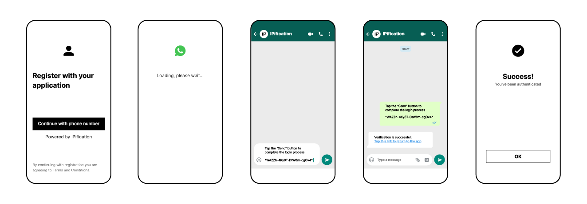
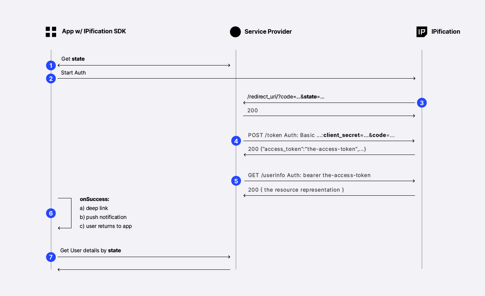

# Android IM Authentication

This document describes the auto mode of IM Authentication.<br>
There are 2 options for IM : `IM Login` (Quick IM Authentication) and `Phone Number Verification` with IM:

**1.[IM Login](#quick-im-authentication)**

When using IM apps for the authentication IPification can provide resolved phone number. With this option, clients can significantly increase the security and user experience of their mobile/web apps, also improving user acquisition, engagement, and retention rates.
For quick IM auth, the scope value should be `scope=openid ip:phone` and `login_hint` is not required.


**2.[Phone Number Verification](#im-phone-number-authentication)**

IM apps can be used to perform phone number verification by adding `scope` = `ip:phone_verify` and providing `login_hint`


# How It Works?

1. Contact IPification to obtain the credentials (client_id and client_secret)
2. Add IPification SDK to your app
3. Configure and start IPification SDK
4. Handle callback from IPification side and perform token exchange in order to get user details

This is a flow diagram:



1. App should obtain unique `state` parameter from app backend service. This parameter will be used as session identifier between IPification and client app (step 3) and also app will use this param to query app backend service for the user details (step 7).
2. App initiate Auth via SDK function call `startAuthentication()`
3. After successful Authentication IPification will do the callback on predefined `redirect_uri` with `code` and `state` params. Client should extract code since it will be used for the next step. It is important to respond with HTTP 200 on this callback.
4. Client should use `code` param to retrieve Access Token - process called Token Exchange. <a href="#/auth/latest/?id=token-exchange" target="_blank">Token Exchange process</a> is a standard OIDC call on /token endpoint via HTTP POST method with client credentials. 
Response will contain `access_token` which can be <a href="https://jwt.io/" target="_blank">decoded</a> in order to retrieve user details - phone number or in case of phone number verification - result if the phone number is verified or not. App backend service should store user details (mapped by key `state`) since it will be required for the step 7.<br>
It’s recommended to make use of common libraries for JWT decoding (list of the libs can be found here: https://openid.net/developers/jwt/). Process of decoding might present an issue for some clients, this is why the flow can be continued in order to receive user details directly from IPification server.
5. Optionally clients can make a final call to retrieve result (user details) directly instead of decoding `access_token` (<a href="#/auth/latest/?id=userinfo-call" target="_blank">user info call details</a>)
6. User has a few options to return to the app: 
   - deep link - clients can make a use of IM success messages and setup deep link as a part of the response message that will be delivered after successful Auth 
   - push notification - clients can implement <a href="#/android/latest/?id=push-notifications" target="_blank">push notification service</a> to notify user to return to the app.
   - or simply users can return to the app manually.

   Any of them will trigger `onSuccess` registered function when app comes into focus.
7. App should implement logic to call app backend service to retrieve user details by `state` param. User details are received in step 4.

# I. Installation

## 1. Requirements 

    # Requirements
    - Gradle Classpath 4+ 

    # Dependency
    - OKHttp 3 / 4

    # Permissions:
    The required permissions for proper functionality of our SDK have already been incorporated within the SDK itself. 
    There is no need for clients to explicitly declare these permissions in their AndroidManifest.xml file, 
    as they are seamlessly handled internally. The following permissions have been included:
      <uses-permission android:name="android.permission.INTERNET" />
      <uses-permission android:name="android.permission.ACCESS_NETWORK_STATE" />
      <uses-permission android:name="android.permission.CHANGE_NETWORK_STATE" />
      <uses-permission android:name="android.permission.ACCESS_WIFI_STATE" />

## 2. Adding IPification SDK

  **2.1 Add IPification's maven to `repositories` block in `project/build.gradle`**:

```json
allprojects {
    repositories {
        google()
        mavenCentral()
        ...
        maven {
            url "https://artifacts.ipification.com/artifactory/mobile-libs-release/"
        }
    }
}
```

Note: When creating a new project in `Android Studio Arctic Fox Canary 8` or newer IDE, Google has made some changes in the project label Gradle.
In `settings.gradle`, add IPification's maven to `repositories`:

  ```json
  dependencyResolutionManagement {
    repositoriesMode.set(RepositoriesMode.FAIL_ON_PROJECT_REPOS)
    repositories {
        google()
        mavenCentral()
        ...
        maven {
            url "https://artifacts.ipification.com/artifactory/mobile-libs-release/"
        }
      }
  }
  ```

**2.2 Add the following lines to the `app/build.gradle`**:

  ```groovy
  implementation 'com.ipification.android:ipification-sdk:2.2.0'
  ```

## 3. Configuration

During the onboarding process, IPification will provide you with SDK configuration. The SDK will read this configuration and use it during the authentication flow.

- **Test Env**

<!-- tabs:start -->
### **Kotlin**

```kotlin
IPConfiguration.getInstance().ENV = IPEnvironment.SANDBOX
IPConfiguration.getInstance().CLIENT_ID = "your-stage-client-id"
IPConfiguration.getInstance().REDIRECT_URI = Uri.parse("your-redirect-uri")
```

### **Java**

```java
IPConfiguration.getInstance().setENV(IPEnvironment.SANDBOX);
IPConfiguration.getInstance().setCLIENT_ID("your-stage-client-id");
IPConfiguration.getInstance().setREDIRECT_URI(Uri.parse("your-redirect-uri"));
```
<!-- tabs:end -->

- **Production Env**

<!-- tabs:start -->
### **Kotlin**

```kotlin
IPConfiguration.getInstance().ENV = IPEnvironment.PRODUCTION
IPConfiguration.getInstance().CLIENT_ID = "your-prod-client-id"
IPConfiguration.getInstance().REDIRECT_URI = Uri.parse("your-prod-redirect-uri")
```

### **Java**

```java
IPConfiguration.getInstance().setENV(IPEnvironment.PRODUCTION);
IPConfiguration.getInstance().setCLIENT_ID("your-prod-client-id");
IPConfiguration.getInstance().setREDIRECT_URI(Uri.parse("your-prod-redirect-uri"));
```
<!-- tabs:end -->


- **env** - this config will instruct SDK to use sandbox or production Auth server endpoints. Choose `.sandbox` during the test and integration phase. Use `.production` for live traffic.

> **<a id="client-id"></a>[CLIENT_ID](#client-id)** - unique identifier of the client that is generated by IPification and provided to the client in the onboarding process.

> **<a id="redirect-uri"></a>[REDIRECT_URI](#redirect-uri)** - In the onboarding process of the client, redirect uri must be provided, this value can represent wildcard uri and will be used to validate provided `redirect_uri` in the request.<br>
  > The format of redirect_uri should be `your-package-name://path/` or `https://your-domain/path`.<br>
  > `redirect_uri` schemes must be lowercase, begin with a letter and be followed by any other letter, number . - or +

<br/>


# II. Usage

## 1. Enable Auto Mode

To enable auto mode, put this function in your initial function before call authentication
<!-- tabs:start -->
### **Kotlin**

```kotlin
IPConfiguration.getInstance().IM_AUTO_MODE = true
IPConfiguration.getInstance().IM_PRIORITY_APP_LIST = arrayOf("wa","telegram")
```

### **Java**

```java
IPConfiguration.getInstance().setIM_AUTO_MODE(true);
IPConfiguration.getInstance().setIM_PRIORITY_APP_LIST(new String[]{"telegram", "viber", "wa"});
```
<!-- tabs:end -->

## 2. Update AndroidManifest

1. Open the `/app/manifest/AndroidManifest.xml` file.
2. Add the following meta-data elements, an activity for IPification:
```xml
 <activity
    android:name="com.ipification.mobile.sdk.im.ui.IMVerificationActivity"
    android:exported="true"
    android:theme="@style/IPTheme"
    android:windowSoftInputMode="adjustPan"
    android:launchMode="singleInstance">
    <intent-filter android:autoVerify="true">
      <action android:name="android.intent.action.VIEW" />
      <category android:name="android.intent.category.BROWSABLE" />
      <category android:name="android.intent.category.DEFAULT" />
      <!--optional: set up Android App Link-->
      <data android:host="your_deep_link_host"
            android:scheme="https" />
    </intent-filter>
</activity>
```

> An Android App Link is a deep link based on your website URL that has been verified to belong to your website. So click one of these immediately opens your app if it's installed — the disambiguation dialog does not appear. Though the user may later change their preference for handling these links. For verifying your App Link check document: <a href="https://developer.android.com/training/app-links/verify-site-associations" target="_blank">Verify Android App Links</a>

## 3. Update onActivityResult of the login activity

User has a few options to return back to the app:

1. deep link in IM success message
2. push notification from the app (<a href="#/android/latest/?id=push-notifications" target="_blank">How to implement push notifications</a>)
3. user manually goes back to the app

In order to invoke IMService when user goes back to the app, you must pass the result to `IMService.onActivityResult()`. IMService will parse Activity Result and then invoke the functions of the `IMCallback` (defined in [next section](#im-authentication-api)).

<!-- tabs:start -->
### **Kotlin**

```kotlin
override fun onActivityResult(requestCode: Int, resultCode: Int, data: Intent?) {
    super.onActivityResult(requestCode, resultCode, data)
    IMService.onActivityResult(requestCode, resultCode, data)
}
```

### **Java**

```java
@Override
protected void onActivityResult(int requestCode, int resultCode, @Nullable Intent data) {
    super.onActivityResult(requestCode, resultCode, data);
    IMService.Factory.onActivityResult(requestCode, resultCode, data);
}
```
<!-- tabs:end -->

## 4. Start Authentication<a id="im-authentication-api"/>

### 4.1. Quick IM Authentication<a id="quick-im-authentication"/>

1. Create an instance of the `AuthRequest.Builder()`
2. Set `scope` values. Use `setScope()` to specify what access privileges are being requested for Access Tokens. For example, use `openid ip:phone` scope for Quick IM Auth
3. Set `state` value. State represents the session identifier so client and IPification can track session across the flow. This is generated by a client application. State is restricted to 255 length String.
4. Create an implementation of `IMCallback` to handle `onSuccess`, `onError`, and `onIMCancel`
5. Perform authentication with `startAuthentication()` function from `IMServices` class

<!-- tabs:start -->
### **Kotlin**

```kotlin
val authRequestBuilder = AuthRequest.Builder()
authRequestBuilder.setScope("openid ip:phone")
authRequestBuilder.setState(your_generated_state)
val authRequest = authRequestBuilder.build()

val authCallback = object : IMCallback
{
    override fun onSuccess(authResponse: AuthResponse) {
        // TODO call your backend service (Step 8)
    }
    override fun onError(error: IPificationError) {
        // error, handle it with another auth service
        Log.e("IPificationSDK","startAuthentication - error: " + error.getErrorMessage())
    }
    override fun onIMCancel() {
        // hide loading view , or do nothing
    }
}
IMServices.startAuthentication(activity = this, authRequest = authRequest, callback = authCallback)
```

### **Java**

```java
AuthRequest.Builder authRequestBuilder = new AuthRequest.Builder();
authRequestBuilder.setScope("openid ip:phone");
authRequestBuilder.setState(your_generated_state);
AuthRequest authRequest = authRequestBuilder.build();

IMCallback authCallback = new IMCallback() {
  @Override
  public void onSuccess(AuthResponse authResponse) {
      // TODO call your backend service (Step 8)
  }
  @Override
  public void onError(@NotNull IPificationError error) {
    // error, handle it with another auth service
    Log.e("IPificationSDK", "startAuthentication - error: " + error.getError_code() + " - "+ error.getErrorMessage());
  }
  @Override 
  public void onIMCancel() {
    // hide loading view , or do nothing
  }
};

IMServices.Factory.startAuthentication(activity = this,  authRequest, authCallback);
```
<!-- tabs:end -->

6. After successful Authentication (user has sent an IM message), IPification will perform callback on predefined `redirect_uri` to deliver `code` parameter. App backend will perform token exchange in order to retrieve user details

7. User returns back to the app and registered activity `onSuccess` or `onError` will be triggered

8. App will call Backend Service to receive the authenticated user information

### 4.2 Phone Number Verification<a id="im-phone-number-authentication"/>

With IM Apps we can provide Phone Number Verification service also. Just provide additional config for the `AuthRequest.Builder()`:

<!-- tabs:start -->
### **Kotlin**

```kotlin
val authRequestBuilder = AuthRequest.Builder()
authRequestBuilder.setScope("openid ip:phone_verify")
authRequestBuilder.addQueryParam("login_hint", country_code + user_input_phone_number)
authRequestBuilder.setState(your_generated_state)
```

### **Java**

```java
AuthRequest.Builder authRequestBuilder = new AuthRequest.Builder();
authRequestBuilder.setScope("openid ip:phone_verify");
authRequestBuilder.addQueryParam("login_hint", country_code + user_input_phone_number);
authRequestBuilder.setState(your_generated_state);
```
<!-- tabs:end -->

When a client wants to validate the phone number, it should be passed via `login_hint​` parameter and IPification will use this value against the resolved value. If values do not match error will be returned at the end of the flow. Phone number should be specified according to the E.164 number formatting (http://en.wikipedia.org/wiki/E.164) without leading `+` sign.

# III. Sample Project

Check out our sample App to see how it works:
<!-- tabs:start -->
## **Kotlin**
https://github.com/bvantagelimited/mobile-sdk-showcase-apps/tree/master/ipification-sdk-android-kotlin

## **Java**
https://github.com/bvantagelimited/mobile-sdk-showcase-apps/tree/master/ipification-sdk-android-java
<!-- tabs:end -->
