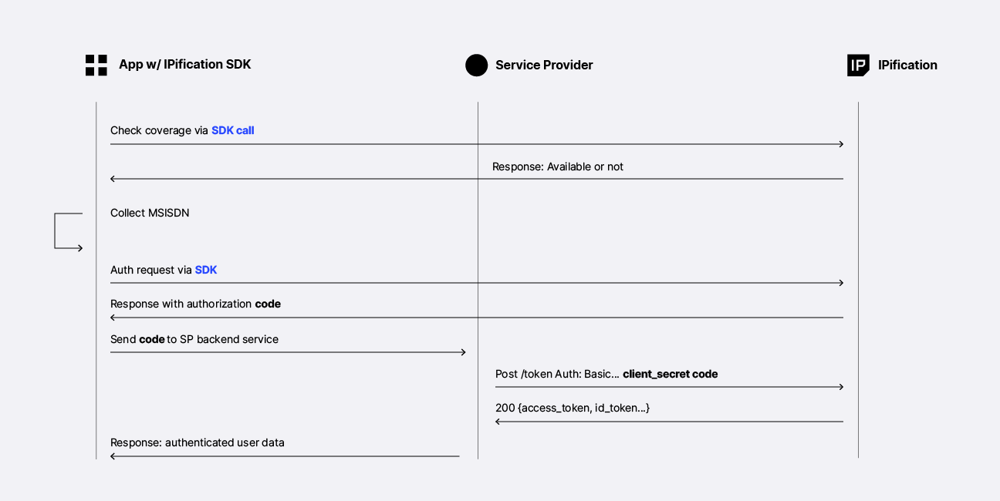
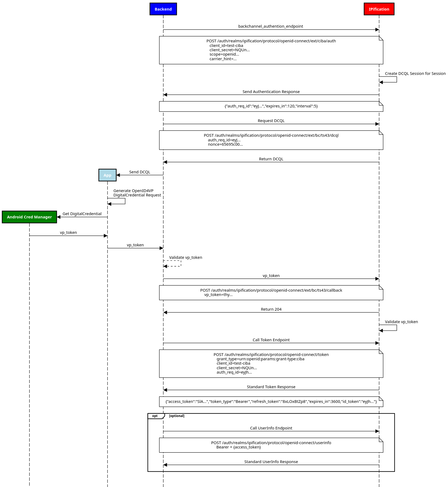
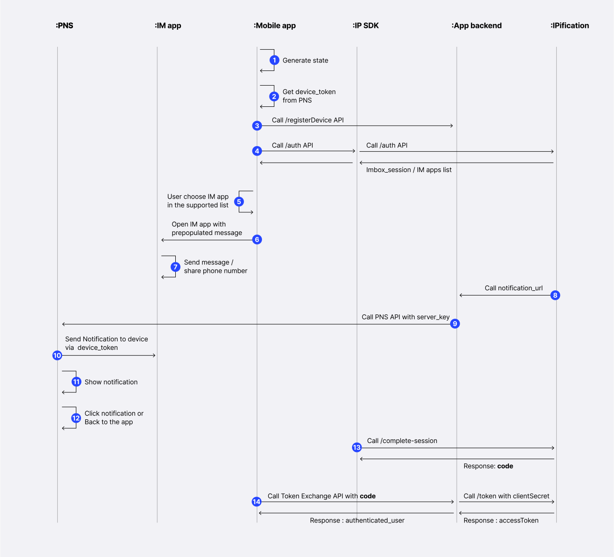
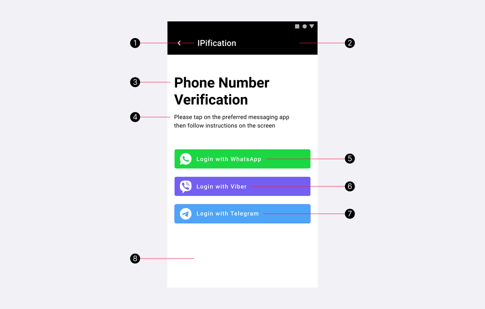

# Android SDK

The IPification Android SDK supports multiple mobile authentication flows:

| Flow | Best for | Availability |
| --- | --- | --- |
| [IPification authentication](#ip-authentication-flow) | Seamless network-based mobile verification. | Mobile network must support IPification. |
| [TS43 authentication](#ts43-authentication-flow) | Phone number verification or retrieval through Android Credential Manager. | Supported TS43 telcos only. |
| [SMS authentication](#sms-authentication-flow) | OTP-based phone number verification. | Supported SMS telcos only. |
| [Multi-auth](#multi-auth-channel-flow) | Trying multiple channels in priority order. | Depends on configured channels. |
| [Instant Message authentication](#im-authentication-flow) | Verification through WhatsApp, Viber, or Telegram. | Works across networks. |

## I. Setup

### SDK Integration Guide

Follow these steps to add the SDK, configure your application, and start an authentication flow.

| Step | Action | Description |
| --- | --- | --- |
| 1 | Contact IPification | Obtain your `client_id` and `client_secret`. |
| 2 | Add the SDK | Install the IPification SDK dependency in your Android application. |
| 3 | Configure the SDK | Initialize the SDK with the configuration provided during onboarding. |
| 4 | Handle callbacks | Process the authentication callback and exchange the authorization code from your backend. |

### 1. Requirements

Before adding the SDK, make sure your Android project meets these requirements:

| Category | Requirement |
| --- | --- |
| Gradle classpath | `8+` |
| Kotlin | `2.2.21` |
| OKHttp | `5.3.2` |

The following permissions are included by the SDK:

```xml
<uses-permission android:name="android.permission.INTERNET" />
<uses-permission android:name="android.permission.ACCESS_NETWORK_STATE" />
<uses-permission android:name="android.permission.CHANGE_NETWORK_STATE" />
<uses-permission android:name="android.permission.ACCESS_WIFI_STATE" />
```

?> **Manifest declaration**
These permissions are bundled with the SDK, so you do not need to declare them manually in your `AndroidManifest.xml`.

### 2. Adding IPification SDK

Add the IPification SDK dependency to `app/build.gradle`:

```groovy
dependencies {
    implementation 'com.ipification.android:ipification-sdk:2.2.1'
}
```

#### 2.3 Configure Cleartext HTTP Requests

Cleartext traffic configuration is only required for the following supported telcos:

| Country | Supported telcos |
| --- | --- |
| Indonesia | XL, Tri, Smartfren |
| Canada | TELUS |
| Mexico | Telcel |
| UK | O2, Vodafone |
| Sri Lanka | Dialog |
| India | Jio |
| India | Airtel |
| Malaysia | CelcomDigi |
| Argentina | Openxpand |

?> **Why this is needed**
These telcos require cleartext network traffic for authentication. Enable cleartext traffic only for the required domains, following the [Android network security configuration guide](https://developer.android.com/training/articles/security-config#CleartextTrafficPermitted).

In the application's manifest file (`AndroidManifest.xml`), add the following line inside the `<application>` tag:

```xml
android:networkSecurityConfig="@xml/ipification_network_security_config"
```

!> **Existing cleartext configuration**
If your application already sets `cleartextTrafficPermitted="true"`, adding this network security config is unnecessary and may cause conflicts. Check your existing configuration before proceeding.

### 3. Configuration

During the onboarding process, IPification will provide you with the necessary SDK configuration. The SDK will utilize this configuration for seamless integration into the authentication flow.

#### 3.1 Configure the Sandbox Environment

Use the sandbox environment while testing your integration:

<!-- tabs:start -->

#### **Kotlin**

```kotlin
  private fun initIPification(){
    IPConfiguration.getInstance().apply {
      ENV = IPEnvironment.SANDBOX
      CLIENT_ID = "your-stage-client-id"
      REDIRECT_URI = Uri.parse("your-redirect-uri")
    }
  }
  ```

#### **Java**

```java
  private void initIPification(){
    IPConfiguration config = IPConfiguration.getInstance();
    config.setENV(IPEnvironment.SANDBOX);
    config.setCLIENT_ID("your-stage-client-id");
    config.setREDIRECT_URI(Uri.parse("your-redirect-uri"));
  };
  ```

<!-- tabs:end -->

#### 3.2 Configure the Production Environment

Use the production environment when your application is ready to go live:

<!-- tabs:start -->

#### **Kotlin**

```kotlin
  private fun initIPification(){
    IPConfiguration.getInstance().apply {
      ENV = IPEnvironment.PRODUCTION
      CLIENT_ID = "your-prod-client-id"
      REDIRECT_URI = Uri.parse("your-prod-redirect-uri")
    }
  }
  ```

#### **Java**

```java
  private void initIPification(){
    IPConfiguration config = IPConfiguration.getInstance();
    config.setENV(IPEnvironment.PRODUCTION);
    config.setCLIENT_ID("your-prod-client-id");
    config.setREDIRECT_URI(Uri.parse("your-prod-redirect-uri"));
  };
  ```

<!-- tabs:end -->

#### 3.3 Configure a Custom Host

Configure `BASE_URL` only when IPification provides a dedicated endpoint for your deployment region or infrastructure, such as a dedicated Indonesia environment.

<!-- tabs:start -->

#### **Kotlin**

```kotlin
  private fun initIPification(){
    IPConfiguration.getInstance().apply {
      BASE_URL = "https://api.new-region.ipification.com"
    }
  }
  ```

#### **Java**

```java
  private void initIPification(){
    IPConfiguration config = IPConfiguration.getInstance();
    config.setBASE_URL("https://api.new-region.ipification.com");
  };
  ```

<!-- tabs:end -->

#### Configuration Parameters

| Parameter | Description |
| --- | --- |
| <a id="client-id"></a>[CLIENT_ID](#client-id) | Unique client identifier generated by IPification and provided during onboarding. |
| <a id="redirect-uri"></a>[REDIRECT_URI](#redirect-uri) | Redirect URI registered during onboarding. It is used to validate the `redirect_uri` sent in authentication requests. |

?> **Redirect URI format**
Use either an app scheme or HTTPS URL:

- `your-package-name://path`
- `https://your-domain/path`

The URI scheme must be lowercase, start with a letter, and contain only letters, numbers, `.`, `-`, or `+`.

For a smooth integration process, verify that the SDK configuration aligns with the provided guidelines during the onboarding process.

## II. Usage
### 1. IPification Authentication Flow :id=ip-authentication-flow

IPification verifies a user's phone number by matching the device's mobile-data source IP address with the mobile operator's IP allocation records. No OTP or SMS is required — the verification is based on a trusted mobile network match.

<div class="sdk-step-card sdk-mechanism-card">
  <div class="sdk-step-card__eyebrow">Core mechanism</div>
  <div class="sdk-checklist">
    <div><span>1</span><p>The device must use mobile data during authentication. The SDK can route the request through cellular data even when Wi‑Fi is connected.</p></div>
    <div><span>2</span><p>The authentication request must originate from the user's device. Do not proxy the IPification authentication request through your backend.</p></div>
    <div><span>3</span><p>Your backend only handles the server-side token exchange after the SDK returns the authorization code.</p></div>
  </div>
</div>

<div class="sdk-flow-compare">
  <div>
    <strong>Success path</strong>
    <code>Device mobile IP → IPification → Operator IP match → Verified</code>
  </div>
  <div>
    <strong>Failure path</strong>
    <code>Device → Proxy/server IP → IPification → Operator IP mismatch → Failed</code>
  </div>
</div>

?> **Before authentication**
Call `startCheckCoverage()` first to confirm that the device and mobile operator support IPification. If coverage is supported, call `startAuthentication()` from the app.

#### Flow Overview

The following diagram shows the high-level IPification authentication flow between your app, your backend service provider, and IPification.



#### 1.1 Collect Mobile Phone Number

Collect the user's mobile phone number before starting authentication. The phone number is used for coverage checks and verification.

You can collect the phone number manually or use one of the supported Android retrieval methods:

| Method | Description | Permission requirement |
| --- | --- | --- |
| Manual input | User enters their mobile phone number in your app. | None |
| Phone Number Hint API | Uses Google Play services to let the user select a phone number. | None |
| TelephonyManager | Retrieves the phone number programmatically when available. | Requires `READ_PHONE_STATE` or `READ_PHONE_NUMBERS` |

?> **Implementation examples**
See the [Android phone number hint code snippets](https://github.com/ipification/ipification-mobile-sdk-code-snippet/blob/main/android-phone-number-hint.md) for implementation examples.

#### 1.2 Check the Coverage

<div class="sdk-step-card sdk-coverage-card">
  <div class="sdk-step-card__eyebrow">Coverage check</div>
  <p class="sdk-step-card__title">Use <code>startCheckCoverage</code> before starting authentication.</p>
  <div class="sdk-decision-grid">
    <div>
      <strong>Available</strong>
      <span>Continue with IPification authentication.</span>
    </div>
    <div>
      <strong>Not available</strong>
      <span>Show another supported authentication option.</span>
    </div>
  </div>
</div>

IPification checks the user's public IP and optional phone number to confirm whether the current mobile network is supported.

Use the Kotlin or Java snippet below:

<!-- tabs:start -->

#### **Kotlin**

```kotlin
  val coverageCallback = object : IPCoverageCallback
    {
      override fun onSuccess(res: CoverageResponse) {
        if(res.isAvailable()) {
            // supported Telco. Call startAuthentication() function
        } else {
            // unsupported Telco. Fallback to another authentication service flow
        }
      }
      override fun onError(error: IPificationError) {
          // Error: {error.getErrorCode() - error.getErrorDescription()}
          // Handle it with another authentication service flow
      }
    }
  IPificationServices.startCheckCoverage(phoneNumber = inputPhoneNumber, context = this, callback = coverageCallback)
  ```

#### **Java**

```java
  IPCoverageCallback coverageCallback = new IPCoverageCallback() {
      @Override
      public void onSuccess(@NonNull CoverageResponse coverageResponse) {
          if(coverageResponse.isAvailable()) {
            // supported Telco. Call startAuthentication() function
          } else {
            // unsupported Telco. Fallback to another authentication service flow
          }
      }
      @Override
      public void onError(@NonNull IPificationError error) {
          // Error: {error.getErrorCode() - error.getErrorDescription()}
          // Handle it with another authentication service flow
      }
  };
  IPificationServices.Factory.startCheckCoverage(phoneNumber = inputPhoneNumber, context= this, callback = coverageCallback);
  ```

<!-- tabs:end -->

Coverage response exposes 2 functions:
- `isAvailable(): boolean` - in case isAvailable() returns _true_ that means the mobile network of the end-user is supported by IPification and you can initiate the Auth process.

- `getOperatorCode(): String?` - resolved Telco operator. This function returns null by default. Read more about it in section [Operator Code](#/auth/latest/?id=operator-data-in-json-response)

Passing `phoneNumber` improves coverage checks, especially on Dual SIM devices.

The SDK uses the phone number prefix to identify the user's telco and compares it with the telco resolved from the device IP address.

?> **Dual SIM behavior**
If the phone number telco and IP-resolved telco do not match, coverage returns `isAvailable() : false`.

Example:

| Input | Result |
| --- | --- |
| Phone number belongs to `TelcoA` | Prefix resolves to `TelcoA` |
| Device IP resolves to `TelcoB` | Telcos do not match |
| Coverage response | `isAvailable() : false` |

#### 1.3 Start Authentication :id=authentication-api
Start authentication after coverage returns `isAvailable() : true`.

<div class="sdk-step-card sdk-auth-card">
  <div class="sdk-step-card__eyebrow">Authentication setup</div>
  <div class="sdk-checklist">
    <div><span>1</span><p>Create an <code>AuthRequest.Builder()</code>.</p></div>
    <div><span>2</span><p>Add <code>login_hint</code> with the user's phone number.</p></div>
    <div><span>3</span><p>Handle <code>onSuccess</code> and <code>onError</code> with <code>IPAuthCallback</code>.</p></div>
    <div><span>4</span><p>Call <code>startAuthentication()</code> from <code>IPificationServices</code>.</p></div>
  </div>
</div>

Use the Kotlin or Java snippet below:

<!-- tabs:start -->

#### **Kotlin**

```kotlin
  val authRequestBuilder = AuthRequest.Builder()
  authRequestBuilder.addQueryParam("login_hint", country_code + user_input_phone_number)
  // authRequestBuilder.setScope("scope value") // optional, default scope is `openid ip:phone_verify`
  // authRequestBuilder.setState("your_state") // optional, to generate state, visit https://auth0.com/docs/protocols/state-parameters
  val authRequest = authRequestBuilder.build()

  val authCallback = object : IPAuthCallback {
    override fun onSuccess(authResponse: IPAuthResponse) {
      // Send authResponse.code to your backend Token Exchange API
    }
    override fun onError(error: IPificationError) {
        // Log or display the error details
        // Continue with another authentication option
    }
  }
  IPificationServices.startAuthentication(activity = this,  authRequest, authCallback)
  ```

#### **Java**

```java
  AuthRequest.Builder authRequestBuilder = new AuthRequest.Builder();
  authRequestBuilder.addQueryParam("login_hint", country_code + user_input_phone_number);
  // authRequestBuilder.setScope("scope value"); // default scope is `openid ip:phone_verify`
  // authRequestBuilder.setState("your_state"); // optional, to generate state, visit https://auth0.com/docs/protocols/state-parameters
  AuthRequest authRequest = authRequestBuilder.build();

  IPAuthCallback authCallback =  new IPAuthCallback() {
    @Override
    public void onSuccess(@NotNull IPAuthResponse authResponse) {
      // Send authResponse.getCode() to your backend Token Exchange API
    }

    @Override
    public void onError(@NotNull IPificationError error) {
      // Log or display the error details
      // Continue with another authentication option
    }
  };
  IPificationServices.Factory.startAuthentication(activity = this,  authRequest, authCallback);
  ```

<!-- tabs:end -->

- Use `setState()` to track the session across the authentication flow. If omitted, IPification generates a random state value.
- Use `setScope()` only when the scope is different from `openid ip:phone_verify`.
- If `consent_id` is required, add it to the authentication request:

<div class="sdk-child-code">

<!-- tabs:start -->

#### **Kotlin**

```kotlin
  # For SDK Version 2.0.15 and above:
  authRequestBuilder.addQueryParam("consent_id", "your_consent_id")

  # For SDK versions 2.0.14 and below:
  IPConfiguration.getInstance().apply {
    CONSENT_ID_VALUE = "your_consent_id"
  }
  ```

#### **Java**

```java
  # For SDK Version 2.0.15 and above:
  authRequestBuilder.addQueryParam("consent_id", "your_consent_id");

  # For SDK versions 2.0.14 and below:
  IPConfiguration config = IPConfiguration.getInstance();
  config.setCONSENT_ID_VALUE("your_consent_id");
  ```

<!-- tabs:end -->

</div>

The `startAuthentication()` response returns either a successful authentication result or an `error`.

| Result | Description |
| --- | --- |
| `code` | Authorization code generated by IPification. Send this value to your backend Token Exchange API. |
| `state` | Optional session identifier returned with the response. Send this value to your backend if you use it to track the authentication session. |

#### 1.4 Call your backend service :id=token-exchange
Send the authentication result to your backend service. The backend exchanges the `code` for tokens and can use `state` to track the session.

<div class="sdk-step-card sdk-backend-card">
  <div class="sdk-step-card__eyebrow">Backend exchange</div>
  <div class="sdk-checklist">
    <div><span>1</span><p>App sends `code` and `state` to your backend.</p></div>
    <div><span>2</span><p>Optional: backend validates `state` against the user session.</p></div>
    <div><span>3</span><p>Backend exchanges `code` with IPification's `/token` endpoint.</p></div>
  </div>
</div>

##### 1.4.1 Exchange the authorization code

Use these parameters in the backend token request:

| Parameter | Description |
| --- | --- |
| `code` | Authorization code returned by `startAuthentication()`. |
| `client_id` | Application client ID provided by IPification. |
| `client_secret` | Application client secret. Keep this value on your backend only. |
| `redirect_uri` | Redirect URI configured for your application. |
| `grant_type` | Set to `authorization_code`. |

<!-- tabs:start -->

#### **Stage**

<div class="sdk-endpoint-card">
  <span>Token endpoint</span>
  <code>POST https://api.stage.ipification.com/auth/realms/ipification/protocol/openid-connect/token</code>
</div>

```http title="Headers"
Content-Type: application/x-www-form-urlencoded
```

```txt title="Form body"
redirect_uri={your-redirect-uri}
grant_type=authorization_code
code={auth-code}
client_id={your-STAGE-client-id}
client_secret={your-STAGE-client-secret}
```

#### **Production**

<div class="sdk-endpoint-card">
  <span>Token endpoint</span>
  <code>POST https://api.id.ipification.com/auth/realms/ipification/protocol/openid-connect/token</code>
</div>

```http title="Headers"
Content-Type: application/x-www-form-urlencoded
```

```txt title="Form body"
redirect_uri={your-redirect-uri}
grant_type=authorization_code
code={auth-code}
client_id={your-PROD-client-id}
client_secret={your-PROD-client-secret}
```

<!-- tabs:end -->

The token response contains:

| Token | Usage |
| --- | --- |
| `access_token` | Call the `/userinfo` endpoint. |
| `id_token` | Decode the JWT to read IPification claims directly. |
| `refresh_token` | Refresh tokens when supported by your backend flow. |

##### 1.4.2 Get user claims

Use one of these backend options:

<div class="sdk-step-card sdk-claims-card">
  <div class="sdk-step-card__eyebrow">User claims</div>
  <div class="sdk-decision-grid">
    <div>
      <strong>Option 1: UserInfo</strong>
      <span>Call `/userinfo` with the `access_token`.</span>
    </div>
    <div>
      <strong>Option 2: ID token</strong>
      <span>Decode the `id_token` JWT on your backend.</span>
    </div>
  </div>
</div>

```bash
curl --location --request POST '/auth/realms/ipification/protocol/openid-connect/userinfo' \
  -H "Content-Type: application/x-www-form-urlencoded" \
  -d "access_token=$ClientAccessToken"
```

<!-- tabs:start -->

#### **ip:phone_verify**

```json
{
  "sub": "99dd91d1-c949-433c-bd9e-0682eb6d6d26",
  "login_hint": "381123456789",
  "phone_number_verified": "true"
}
```

#### **ip:phone**

```json
{
  "sub": "99dd91d1-c949-433c-bd9e-0682eb6d6d26",
  "phone_number": "381123456789"
}
```

<!-- tabs:end -->

| Claim | Description |
| --- | --- |
| `sub` | OpenID subject identifier. If phone verification fails, the value can be `anonymous`. |
| `login_hint` | Original phone number value submitted in the auth request. Validate it against the request value. |
| `phone_number_verified` | `true` when the submitted phone number matches; otherwise handle the authentication as failed. |
| `phone_number` | Resolved end-user phone number in E.164 format without the leading `+`. |
| `mobile_id` | IPification Mobile ID network identifier for the user. |

!> **Validate login_hint**
If the returned `login_hint` does not match the value sent in the auth request, treat the authentication as invalid.

### 2. TS43 Authentication Flow :id=ts43-authentication-flow

TS43 supports phone number verification and phone number retrieval for supported telcos. It uses Android Credential Manager and Client-Initiated Backchannel Authentication (CIBA).

<div class="sdk-step-card sdk-ts43-card">
  <div class="sdk-step-card__eyebrow">TS43 flow</div>
  <div class="sdk-checklist">
    <div><span>1</span><p>App calls <code>startAuthentication()</code>.</p></div>
    <div><span>2</span><p>SDK calls your backend <code>/ts43/auth</code> endpoint.</p></div>
    <div><span>3</span><p>SDK launches Android Credential Manager and extracts the VP token.</p></div>
    <div><span>4</span><p>SDK calls your backend <code>/ts43/token</code> endpoint and returns the token response.</p></div>
  </div>
</div>

#### TS43 Mobile App Flow Diagram :id=ts43-mobile-app-flow-diagram



This diagram shows the mobile-app side of the flow: the SDK starts authentication, uses Credential Manager, and calls your configured backend endpoints.

!> **Backend required**
Configure the backend base URL and paths before starting TS43. Your backend owns the TS43 server-side integration; the Android app does not call <code>/ts43/auth</code> or <code>/ts43/token</code> directly.

For the backend implementation, see [TS43 API](#/ts43/latest/).

#### Supported TS43 Telcos

| Country | TS43 supported telcos |
| --- | --- |
| Indonesia | Telkomsel |

#### 2.1 Configure TS43

Set the TS43 backend URLs and endpoint paths before calling authentication.

| Configuration | Description |
| --- | --- |
| `TS43_BACKEND_URL_SANDBOX` | Backend base URL for sandbox testing. |
| `TS43_BACKEND_URL_PRODUCTION` | Backend base URL for production. |
| `TS43_AUTH_PATH` | Backend path that starts the TS43 auth request. |
| `TS43_TOKEN_PATH` | Backend path that exchanges the VP token. |

<!-- tabs:start -->

#### **Kotlin**

```kotlin
private fun initTS43() {
  val env = IPEnvironment.SANDBOX // or IPEnvironment.PRODUCTION

  IPConfiguration.getInstance().apply {
    ENV = env
    CLIENT_ID = if (env == IPEnvironment.SANDBOX) {
      "your-stage-client-id"
    } else {
      "your-prod-client-id"
    }

    // Your backend TS43 endpoints
    TS43_BACKEND_URL_SANDBOX = "https://stage.your-backend.com"
    TS43_BACKEND_URL_PRODUCTION = "https://your-backend.com"
    TS43_AUTH_PATH = "/ts43/auth"
    TS43_TOKEN_PATH = "/ts43/token"
  }
}
```

#### **Java**

```java
private void initTS43() {
  IPEnvironment env = IPEnvironment.SANDBOX; // or IPEnvironment.PRODUCTION

  IPConfiguration config = IPConfiguration.getInstance();
  config.setENV(env);
  config.setCLIENT_ID(
    env == IPEnvironment.SANDBOX ? "your-stage-client-id" : "your-prod-client-id"
  );

  // Your backend TS43 endpoints
  config.setTS43_BACKEND_URL_SANDBOX("https://stage.your-backend.com");
  config.setTS43_BACKEND_URL_PRODUCTION("https://your-backend.com");
  config.setTS43_AUTH_PATH("/ts43/auth");
  config.setTS43_TOKEN_PATH("/ts43/token");
}
```

<!-- tabs:end -->

#### 2.2 Start TS43 Phone Number Verification

Use this flow when the user enters a phone number and you need to verify that it matches the SIM. TS43 uses the SDK-managed `startAuthentication()` entry point and does not require IP coverage checking.

<div class="sdk-step-card sdk-auth-card">
  <div class="sdk-step-card__eyebrow">Verification setup</div>
  <div class="sdk-checklist">
    <div><span>1</span><p>Set TS43 as the authentication channel.</p></div>
    <div><span>2</span><p>Add <code>login_hint</code> with the user's phone number.</p></div>
    <div><span>3</span><p>Use scope <code>openid ip:phone_verify</code>.</p></div>
    <div><span>4</span><p>Handle <code>ts43TokenResponse</code> in <code>onSuccess</code>.</p></div>
  </div>
</div>

<!-- tabs:start -->

#### **Kotlin**

```kotlin
IPConfiguration.getInstance().AUTH_CHANNELS = listOf(AuthChannel.TS43)

val authRequestBuilder = AuthRequest.Builder()
authRequestBuilder.addQueryParam("login_hint", country_code + user_input_phone_number)
authRequestBuilder.setScope("openid ip:phone_verify")
val authRequest = authRequestBuilder.build()

IPificationServices.startAuthentication(
  activity = this,
  authRequest = authRequest,
  callback = object : IPAuthCallback {
    override fun onSuccess(response: IPAuthResponse) {
      if (response.ts43TokenResponse != null) {
        // TS43 success.
        val ts43Response = response.ts43TokenResponse
        val fullResponse = response.fullResponse
      }
    }

    override fun onError(error: IPificationError) {
      // Handle TS43 error.
    }
  }
)
```

#### **Java**

```java
IPConfiguration.getInstance().setAUTH_CHANNELS(
  java.util.Collections.singletonList(AuthChannel.TS43)
);

AuthRequest.Builder authRequestBuilder = new AuthRequest.Builder();
authRequestBuilder.addQueryParam("login_hint", country_code + user_input_phone_number);
authRequestBuilder.setScope("openid ip:phone_verify");
AuthRequest authRequest = authRequestBuilder.build();

IPificationServices.startAuthentication(
  this,
  authRequest,
  new IPAuthCallback() {
    @Override
    public void onSuccess(@NonNull IPAuthResponse response) {
      if (response.getTs43TokenResponse() != null) {
        // TS43 success.
        TS43TokenResponse ts43Response = response.getTs43TokenResponse();
        String fullResponse = response.getFullResponse();
      }
    }

    @Override
    public void onError(@NonNull IPificationError error) {
      // Handle TS43 error.
    }
  }
);
```

<!-- tabs:end -->

#### 2.3 Request Parameters

Use these request parameters for TS43 authentication:

| Parameter | Required | Description |
| --- | --- | --- |
| `login_hint` | Yes | User phone number for phone number verification. |
| `scope` | Optional | Defaults to `openid ip:phone_verify` if not overridden. |
| Custom auth params | Optional | Add only when required by your backend auth contract. |
| Custom token params | Optional | Add only when required by your backend token contract. |

<!-- tabs:start -->

#### **Kotlin**

```kotlin
authRequestBuilder.addQueryParam("login_hint", country_code + user_input_phone_number)
authRequestBuilder.setScope("openid ip:phone_verify")

// Optional, only if required by your backend:
authRequestBuilder.addQueryParam("custom_auth_param", "value")
authRequestBuilder.addTS43TokenCustomParam("custom_token_param", "value")
```

#### **Java**

```java
authRequestBuilder.addQueryParam("login_hint", country_code + user_input_phone_number);
authRequestBuilder.setScope("openid ip:phone_verify");

// Optional, only if required by your backend:
authRequestBuilder.addQueryParam("custom_auth_param", "value");
authRequestBuilder.addTS43TokenCustomParam("custom_token_param", "value");
```

<!-- tabs:end -->

#### 2.4 Optional Helper APIs

Use these helpers before starting TS43 when you want a quick readiness check:

| Helper | Purpose |
| --- | --- |
| `TS43Services.isConfigured()` | Checks whether the backend URL and TS43 paths are configured. |
| `TS43Services.isCredentialManagerAvailable()` | Checks whether Credential Manager classes are available in the app. |

<!-- tabs:start -->

#### **Kotlin**

```kotlin
if (!TS43Services.isConfigured()) {
  // Configure TS43_BACKEND_URL_SANDBOX / TS43_BACKEND_URL_PRODUCTION,
  // TS43_AUTH_PATH, and TS43_TOKEN_PATH before starting TS43.
}

if (!TS43Services.isCredentialManagerAvailable()) {
  // Credential Manager dependency is missing or unavailable.
}
```

#### **Java**

```java
if (!TS43Services.isConfigured()) {
  // Configure TS43_BACKEND_URL_SANDBOX / TS43_BACKEND_URL_PRODUCTION,
  // TS43_AUTH_PATH, and TS43_TOKEN_PATH before starting TS43.
}

if (!TS43Services.isCredentialManagerAvailable()) {
  // Credential Manager dependency is missing or unavailable.
}
```

<!-- tabs:end -->

### 3. SMS Authentication Flow :id=sms-authentication-flow

Use SMS when you want OTP-based phone number verification. This flow is available only for supported telcos.

#### Supported SMS Telcos

| Country | SMS supported telcos |
| --- | --- |
| Indonesia | Telkomsel |

<div class="sdk-step-card sdk-sms-card">
  <div class="sdk-step-card__eyebrow">SMS OTP flow</div>
  <div class="sdk-checklist">
    <div><span>1</span><p>Set <code>AUTH_CHANNELS = listOf(AuthChannel.SMS)</code>.</p></div>
    <div><span>2</span><p>SDK calls your configured <code>SMS_AUTH_PATH</code> endpoint and sends the OTP.</p></div>
    <div><span>3</span><p>User enters the OTP in your app.</p></div>
    <div><span>4</span><p>Call <code>IPificationServices.verifySMSOTP()</code> to complete token exchange.</p></div>
  </div>
</div>

#### 3.1 Configure SMS

<!-- tabs:start -->

#### **Kotlin**

```kotlin
val env = IPEnvironment.SANDBOX // or IPEnvironment.PRODUCTION

IPConfiguration.getInstance().apply {
  ENV = env
  CLIENT_ID = if (env == IPEnvironment.SANDBOX) {
    "your-stage-client-id"
  } else {
    "your-prod-client-id"
  }

  SMS_BACKEND_URL_SANDBOX = "https://stage.your-backend.com"
  SMS_BACKEND_URL_PRODUCTION = "https://your-backend.com"
  SMS_AUTH_PATH = "/sms/auth"
  SMS_TOKEN_PATH = "/sms/token"
}
```

#### **Java**

```java
IPEnvironment env = IPEnvironment.SANDBOX; // or IPEnvironment.PRODUCTION

IPConfiguration config = IPConfiguration.getInstance();
config.setENV(env);
config.setCLIENT_ID(
  env == IPEnvironment.SANDBOX ? "your-stage-client-id" : "your-prod-client-id"
);

config.setSMS_BACKEND_URL_SANDBOX("https://stage.your-backend.com");
config.setSMS_BACKEND_URL_PRODUCTION("https://your-backend.com");
config.setSMS_AUTH_PATH("/sms/auth");
config.setSMS_TOKEN_PATH("/sms/token");
```

<!-- tabs:end -->

#### 3.2 Start SMS Verification

<!-- tabs:start -->

#### **Kotlin**

```kotlin
IPConfiguration.getInstance().AUTH_CHANNELS = listOf(AuthChannel.SMS)

val authRequestBuilder = AuthRequest.Builder()
authRequestBuilder.addQueryParam("login_hint", country_code + user_input_phone_number)
authRequestBuilder.setScope("openid ip:phone_verify")
val authRequest = authRequestBuilder.build()

IPificationServices.startAuthentication(
  activity = this,
  authRequest = authRequest,
  callback = object : MultiAuthCallback {
    override fun onSuccess(response: IPAuthResponse) {
      // SMS does not complete in this callback.
      // Complete it after onOTPRequired() by calling verifySMSOTP().
    }

    override fun onOTPRequired(response: SMSAuthResponse) {
      // OTP was sent. Save these values and show your OTP input UI.
      val authReqId = response.authReqId
      val nonce = response.nonce
    }

    override fun onError(error: IPificationError) {
      // Handle SMS auth initiation error.
    }
  }
)
```

#### **Java**

```java
IPConfiguration.getInstance().setAUTH_CHANNELS(
  java.util.Collections.singletonList(AuthChannel.SMS)
);

AuthRequest.Builder authRequestBuilder = new AuthRequest.Builder();
authRequestBuilder.addQueryParam("login_hint", country_code + user_input_phone_number);
authRequestBuilder.setScope("openid ip:phone_verify");
AuthRequest authRequest = authRequestBuilder.build();

IPificationServices.startAuthentication(
  this,
  authRequest,
  new MultiAuthCallback() {
    @Override
    public void onSuccess(@NonNull IPAuthResponse response) {
      // SMS does not complete in this callback.
      // Complete it after onOTPRequired() by calling verifySMSOTP().
    }

    @Override
    public void onOTPRequired(@NonNull SMSAuthResponse response) {
      // OTP was sent. Save these values and show your OTP input UI.
      String authReqId = response.getAuthReqId();
      String nonce = response.getNonce();
    }

    @Override
    public void onError(@NonNull IPificationError error) {
      // Handle SMS auth initiation error.
    }
  }
);
```

<!-- tabs:end -->

#### 3.3 Verify OTP

After `onOTPRequired()`, pass the saved `authReqId`, `nonce`, and user-entered OTP to `verifySMSOTP()`. The SDK calls your configured `SMS_TOKEN_PATH` endpoint and returns the final `SMSTokenResponse`.

<!-- tabs:start -->

#### **Kotlin**

```kotlin
IPificationServices.verifySMSOTP(
  activity = this,
  otpCode = user_entered_otp_code,
  authReqId = saved_auth_req_id,
  nonce = saved_nonce,
  callback = object : SMSCallback {
    override fun onAuthInitiated(response: SMSAuthResponse) {
      // Required by SMSCallback, but verifySMSOTP() does not call this method.
      // onAuthInitiated() is not called by verifySMSOTP().
    }

    override fun onSuccess(response: SMSTokenResponse) {
      // This is the verifySMSOTP() response returned after OTP validation
      // and token exchange are completed.
      val isVerified = response.phoneNumberVerified
      val phoneNumber = response.phoneNumber
      val loginHint = response.loginHint
      val subject = response.sub
      val rawResponse = response.rawResponse
    }

    override fun onError(error: IPificationError) {
      // Handle invalid OTP or token exchange error.
    }
  }
)
```

#### **Java**

```java
IPificationServices.verifySMSOTP(
  this,
  user_entered_otp_code,
  saved_auth_req_id,
  saved_nonce,
  new SMSCallback() {
    @Override
    public void onAuthInitiated(@NonNull SMSAuthResponse response) {
      // Required by SMSCallback, but verifySMSOTP() does not call this method.
      // onAuthInitiated() is not called by verifySMSOTP().
    }

    @Override
    public void onSuccess(@NonNull SMSTokenResponse response) {
      // This is the verifySMSOTP() response returned after OTP validation
      // and token exchange are completed.
      boolean isVerified = response.getPhoneNumberVerified();
      String phoneNumber = response.getPhoneNumber();
      String loginHint = response.getLoginHint();
      String subject = response.getSub();
      String rawResponse = response.getRawResponse();
    }

    @Override
    public void onError(@NonNull IPificationError error) {
      // Handle invalid OTP or token exchange error.
    }
  }
);
```

<!-- tabs:end -->

### 4. Multi-auth Channel Flow :id=multi-auth-channel-flow

Use multi-auth when you want the SDK to try more than one channel in priority order. Configure each channel backend first, set <code>AUTH_CHANNELS</code>, then call <code>IPificationServices.startAuthentication()</code> with <code>MultiAuthCallback</code>.

| Channel | Success result | App action |
| --- | --- | --- |
| TS43 | <code>ts43TokenResponse</code> | Use the token response returned by the SDK. |
| IPification | <code>fullResponse</code> or <code>code</code> | If only <code>code</code> is returned, send it to your backend for token exchange. |
| SMS | <code>onOTPRequired()</code> | Show OTP input, then call <code>verifySMSOTP()</code>. |

!> **Keep secrets on backend**
Do not put <code>client_secret</code> in the Android app. If you use <code>IP_TOKEN_URL</code>, point it to your backend token-exchange endpoint so your backend can add the client secret securely.

#### 4.1 Configure Multi-auth Channels

<!-- tabs:start -->

#### **Kotlin**

```kotlin
private fun initIPification() {
  IPConfiguration.getInstance().apply {
    ENV = IPEnvironment.SANDBOX
    CLIENT_ID = "your-client-id"
    REDIRECT_URI = Uri.parse("your-package-name://callback")

    // TS43 backend managed by your application backend.
    TS43_BACKEND_URL_SANDBOX = "https://your-backend.example.com"
    TS43_BACKEND_URL_PRODUCTION = "https://your-backend.example.com"
    TS43_AUTH_PATH = "/ts43/auth"
    TS43_TOKEN_PATH = "/ts43/token"

    // SMS backend managed by your application backend.
    SMS_BACKEND_URL_SANDBOX = "https://your-backend.example.com"
    SMS_BACKEND_URL_PRODUCTION = "https://your-backend.example.com"
    SMS_AUTH_PATH = "/sms/auth"
    SMS_TOKEN_PATH = "/sms/token"

    // Optional but recommended for multi-auth.
    // When set, the SDK exchanges the IP authorization code through your backend.
    IP_TOKEN_URL = "https://your-backend.example.com/ip/token"

    // Priority order. The SDK tries the next channel when the current channel fails.
    AUTH_CHANNELS = listOf(AuthChannel.TS43, AuthChannel.IP, AuthChannel.SMS)
  }
}
```

#### **Java**

```java
private void initIPification() {
  IPConfiguration config = IPConfiguration.getInstance();
  config.setENV(IPEnvironment.SANDBOX);
  config.setCLIENT_ID("your-client-id");
  config.setREDIRECT_URI(Uri.parse("your-package-name://callback"));

  // TS43 backend managed by your application backend.
  config.setTS43_BACKEND_URL_SANDBOX("https://your-backend.example.com");
  config.setTS43_BACKEND_URL_PRODUCTION("https://your-backend.example.com");
  config.setTS43_AUTH_PATH("/ts43/auth");
  config.setTS43_TOKEN_PATH("/ts43/token");

  // SMS backend managed by your application backend.
  config.setSMS_BACKEND_URL_SANDBOX("https://your-backend.example.com");
  config.setSMS_BACKEND_URL_PRODUCTION("https://your-backend.example.com");
  config.setSMS_AUTH_PATH("/sms/auth");
  config.setSMS_TOKEN_PATH("/sms/token");

  // Optional but recommended for multi-auth.
  // When set, the SDK exchanges the IP authorization code through your backend.
  config.setIP_TOKEN_URL("https://your-backend.example.com/ip/token");

  // Priority order. The SDK tries the next channel when the current channel fails.
  config.setAUTH_CHANNELS(
    java.util.Arrays.asList(AuthChannel.TS43, AuthChannel.IP, AuthChannel.SMS)
  );
}
```

<!-- tabs:end -->

#### 4.2 Start Multi-auth

<!-- tabs:start -->

#### **Kotlin**

```kotlin
val authRequestBuilder = AuthRequest.Builder()
authRequestBuilder.addQueryParam("login_hint", country_code + user_input_phone_number)
authRequestBuilder.setScope("openid ip:phone_verify")
val authRequest = authRequestBuilder.build()

IPificationServices.startAuthentication(
  activity = this,
  authRequest = authRequest,
  callback = object : MultiAuthCallback {
    override fun onSuccess(response: IPAuthResponse) {
      when {
        response.ts43TokenResponse != null -> {
          // TS43 success. SDK already completed TS43 token exchange.
          val rawResponse = response.fullResponse
        }
        response.fullResponse.isNotEmpty() -> {
          // IP success with SDK-managed token exchange through IP_TOKEN_URL.
          val rawTokenResponse = response.fullResponse
        }
        response.code.isNotEmpty() -> {
          // IP success without IP_TOKEN_URL.
          // Send response.code to your backend for token exchange.
        }
        else -> {
          // Handle any other completed response returned by the SDK.
        }
      }
    }

    override fun onOTPRequired(response: SMSAuthResponse) {
      // SMS channel selected. Save these values and show your OTP input screen.
      val authReqId = response.authReqId
      val nonce = response.nonce
    }

    override fun onError(error: IPificationError) {
      // All configured channels failed.
    }
  }
)
```

#### **Java**

```java
AuthRequest.Builder authRequestBuilder = new AuthRequest.Builder();
authRequestBuilder.addQueryParam("login_hint", country_code + user_input_phone_number);
authRequestBuilder.setScope("openid ip:phone_verify");
AuthRequest authRequest = authRequestBuilder.build();

IPificationServices.startAuthentication(this, authRequest, new MultiAuthCallback() {
  @Override
  public void onSuccess(@NonNull IPAuthResponse response) {
    if (response.getTs43TokenResponse() != null) {
      // TS43 success. SDK already completed TS43 token exchange.
      String rawResponse = response.getFullResponse();
    } else if (!response.getFullResponse().isEmpty()) {
      // IP success with SDK-managed token exchange through IP_TOKEN_URL.
      String rawTokenResponse = response.getFullResponse();
    } else if (!response.getCode().isEmpty()) {
      // IP success without IP_TOKEN_URL.
      // Send response.getCode() to your backend for token exchange.
    } else {
      // Handle any other completed response returned by the SDK.
    }
  }

  @Override
  public void onOTPRequired(@NonNull SMSAuthResponse response) {
    // SMS channel selected. Save these values and show your OTP input screen.
    String authReqId = response.getAuthReqId();
    String nonce = response.getNonce();
  }

  @Override
  public void onError(@NonNull IPificationError error) {
    // All configured channels failed.
  }
});
```

<!-- tabs:end -->

#### 4.3 Complete SMS OTP

After `onOTPRequired()`, verify the OTP to complete the SMS channel. The SDK calls your configured `SMS_TOKEN_PATH` endpoint and returns `SMSTokenResponse`.

<!-- tabs:start -->

#### **Kotlin**

```kotlin
IPificationServices.verifySMSOTP(
  activity = this,
  otpCode = user_entered_otp_code,
  authReqId = saved_auth_req_id,
  nonce = saved_nonce,
  callback = object : SMSCallback {
    override fun onAuthInitiated(response: SMSAuthResponse) {
      // Required by SMSCallback, but verifySMSOTP() does not call this method.
    }

    override fun onSuccess(response: SMSTokenResponse) {
      if (response.phoneNumberVerified) {
        val phoneNumber = response.phoneNumber
        val rawResponse = response.rawResponse
      }
    }

    override fun onError(error: IPificationError) {
      // Invalid OTP, expired OTP, or SMS token exchange failed.
    }
  }
)
```

#### **Java**

```java
IPificationServices.verifySMSOTP(
  this,
  user_entered_otp_code,
  saved_auth_req_id,
  saved_nonce,
  new SMSCallback() {
    @Override
    public void onAuthInitiated(@NonNull SMSAuthResponse response) {
      // Required by SMSCallback, but verifySMSOTP() does not call this method.
    }

    @Override
    public void onSuccess(@NonNull SMSTokenResponse response) {
      if (response.getPhoneNumberVerified()) {
        String phoneNumber = response.getPhoneNumber();
        String rawResponse = response.getRawResponse();
      }
    }

    @Override
    public void onError(@NonNull IPificationError error) {
      // Invalid OTP, expired OTP, or SMS token exchange failed.
    }
  }
);
```

<!-- tabs:end -->

### 5. Instant Message (IM) Authentication Flow :id=im-authentication-flow

Instant Message (IM) authentication lets users verify through WhatsApp, Viber, or Telegram. Use it when IPification network coverage is unavailable, or when you want to offer IM as an alternate channel.

<div class="sdk-step-card sdk-im-card">
  <div class="sdk-step-card__eyebrow">IM options</div>
  <div class="sdk-decision-grid">
    <div>
      <strong>IM Login</strong>
      <span>Use <code>openid ip:phone</code>. <code>login_hint</code> is not required.</span>
    </div>
    <div>
      <strong>Phone Number Verification</strong>
      <span>Use <code>openid ip:phone_verify</code> with <code>login_hint</code>.</span>
    </div>
  </div>
</div>

#### Supported IM Channels :id=im-supported-channels

| Channel | Value |
| --- | --- |
| WhatsApp | <code>wa</code> |
| Viber | <code>viber</code> |
| Telegram | <code>telegram</code> |

!> **Coverage check not required**
IM authentication works across networks, so you do not need to call coverage check before starting this flow.

#### 5.1 Update onActivityResult of the login activity
You must pass the result to `IMService.onActivityResult()`. IMService will parse Activity Result and then invoke the functions of the `IMCallback` (defined in [next section](#im-authentication-api)).

<!-- tabs:start -->

#### **Kotlin**

```kotlin
override fun onActivityResult(requestCode: Int, resultCode: Int, data: Intent?) {
    super.onActivityResult(requestCode, resultCode, data)
    IMService.onActivityResult(requestCode, resultCode, data)
}
```

#### **Java**

```java

@Override
protected void onActivityResult(int requestCode, int resultCode, @Nullable Intent data) {
    super.onActivityResult(requestCode, resultCode, data);
    IMService.Factory.onActivityResult(requestCode, resultCode, data);
}

```

<!-- tabs:end -->

#### 5.2 Start Authentication :id=im-authentication-api

Build an <code>AuthRequest</code>, set the IM channels, and call <code>IMServices.startAuthentication()</code>.

<div class="sdk-step-card sdk-auth-card">
  <div class="sdk-step-card__eyebrow">IM authentication setup</div>
  <div class="sdk-checklist">
    <div><span>1</span><p>Create an <code>AuthRequest.Builder()</code>.</p></div>
    <div><span>2</span><p>Set <code>scope</code>: <code>openid ip:phone</code> or <code>openid ip:phone_verify</code>.</p></div>
    <div><span>3</span><p>Add <code>login_hint</code> only for phone number verification.</p></div>
    <div><span>4</span><p>Add <code>channel</code> values such as <code>wa viber telegram</code>.</p></div>
    <div><span>5</span><p>Handle <code>onSuccess</code>, <code>onError</code>, and <code>onIMCancel</code>.</p></div>
  </div>
</div>

<!-- tabs:start -->

#### **Kotlin**

```kotlin
val authRequestBuilder = AuthRequest.Builder()
authRequestBuilder.setScope("openid ip:phone")
authRequestBuilder.addQueryParam("channel", "wa viber telegram")
// authRequestBuilder.setState("your_generated_state") (optional)
val authRequest = authRequestBuilder.build()

val authCallback = object : IMCallback
{
    override fun onSuccess(authResponse: AuthResponse) {
        // received code, call your Token Exchange API with {authResponse.getCode()} (2.3)
        // Log.d("IPificationSDK","startAuthentication - success: " + authResponse.getCode())
    }
    override fun onError(error: IPificationError) {
        // error, handle it with another auth service
        Log.e("IPificationSDK","startAuthentication - error: " + error.getErrorMessage())
    }
    override fun onIMCancel() {
        // hide loading view , or do nothing
    }
}
IMServices.startAuthentication(activity = this, authRequest = authRequest, callback = authCallback)

```

#### **Java**

```java

AuthRequest.Builder authRequestBuilder = new AuthRequest.Builder();
authRequestBuilder.setScope("openid ip:phone");
authRequestBuilder.addQueryParam("channel", "wa viber telegram");
// authRequestBuilder.setState("your_generated_state");  (optional)
AuthRequest authRequest = authRequestBuilder.build();

IMCallback authCallback = new IMCallback() {
  @Override
  public void onSuccess(AuthResponse authResponse) {
      // received code, call your Token Exchange API with {authResponse.getCode()} (2.3
      // Log.d("IPificationSDK","startAuthentication - success: " + authResponse.getCode());
  }
  @Override
  public void onError(@NotNull IPificationError error) {
    // error, handle it with another auth service
    // Log.e("IPificationSDK", "startAuthentication - error: " + error.getError_code() + " - "+ error.getErrorMessage());
  }
  @Override
  public void onIMCancel() {
    // hide your own loading view , or do nothing
  }
};

IMServices.Factory.startAuthentication(activity = this,  authRequest, authCallback);

```

<!-- tabs:end -->

The `startAuthentication()` response returns either an authorization `code`, an `error`, or `onIMCancel()` when the user cancels the IM flow.

| Result | Description |
| --- | --- |
| `code` | Send this authorization code to your backend Token Exchange API. |
| `error` | Continue with another authentication option. |
| `onIMCancel()` | Hide loading UI or let the user choose another channel. |

#### 5.3 Exchange the authorization_code for an access token

Call your backend service to get the user information .
Token Exchange call is a standard API call described in [Token Exchange](#token-exchange) section.

#### 5.4 Back to your app from the IM app

After the user completes verification in the IM app, bring the user back to your app using one of these options:

| Return option | When to use |
| --- | --- |
| Deep link | Include an app link in the IM success message. |
| Push notification | Notify the user when the IM session is complete. |
| Manual return | Let the user switch back to your app manually. |

When your app returns to focus, the SDK completes the session and calls the registered success or error callback.

##### 5.4.1 Set-up Deep Link :id=deep-link

<div class="sdk-step-card">
  <div class="sdk-step-card__eyebrow">Android Manifest</div>
  <div class="sdk-checklist">
    <div><span>1</span><p>Open `app/src/main/AndroidManifest.xml`.</p></div>
    <div><span>2</span><p>Add the IPification IM activity and intent filter inside the `<application>` tag.</p></div>
  </div>
</div>

```xml
<activity
    android:name="com.ipification.mobile.sdk.im.ui.IMVerificationActivity"
    android:exported="true"
    android:theme="@style/IPTheme"
    android:windowSoftInputMode="adjustPan"
    android:launchMode="singleInstance">
    <intent-filter android:autoVerify="true">
        <action android:name="android.intent.action.VIEW" />
        <category android:name="android.intent.category.BROWSABLE" />
        <category android:name="android.intent.category.DEFAULT" />

        <data
            android:host="your_deep_link_host"
            android:scheme="https" />
    </intent-filter>
</activity>
```

3. Update `android:host` and `android:scheme` with your deep link values.

?> **Android App Links**
Use Android App Links when your deep link uses an HTTPS URL owned by your domain. After verification, Android can open your app directly without showing the app chooser. See [Verify Android App Links](https://developer.android.com/training/app-links/verify-site-associations).

##### 5.4.2 Setup Push Notification :id=push-notifications

Use push notifications when you want to bring the user back to your app after the IM session is completed.

<div class="sdk-step-card sdk-im-push-card">
  <div class="sdk-step-card__eyebrow">Push return flow</div>
  <div class="sdk-checklist">
    <div><span>1</span><p><span id="push-notifications-state-gen"></span>Generate <code>state</code> and register <code>device_token</code> with your backend.</p></div>
    <div><span>2</span><p><span id="push-notifications-init-auth"></span>Start IM authentication with the same <code>state</code>.</p></div>
    <div><span>3</span><p>IPification calls your Client Notification URL when the IM session completes.</p></div>
    <div><span>4</span><p>Your backend sends a push notification to the registered device.</p></div>
    <div><span>5</span><p>User taps the notification and the SDK completes the session with an authorization <code>code</code>.</p></div>
  </div>
</div>



##### 5.4.2.1 Setup your PNS and Get Device Token

Set up a push notification service that can deliver data messages to the mobile device. You can use FCM, OneSignal, or your own push service.

##### 5.4.2.2 Handle Push Notification Data :id=handle-push-notification

When the user opens the notification, route the app back to `IMVerificationActivity` so the SDK can continue the IM flow.

Sample apps with push notification handling:

<!-- tabs:start -->

#### **Kotlin**

```
https://github.com/ipification/mobile-sdk-showcase-apps/tree/master/ipification-sdk-android-kotlin
```

#### **Java**

```
https://github.com/ipification/mobile-sdk-showcase-apps/tree/master/ipification-sdk-android-java
```

<!-- tabs:end -->

This is example of function that will handle push notification of `FCM` and open back  `IMVerificationActivity` class:

<!-- tabs:start -->

#### **Kotlin**

```kotlin
private fun showIPNotification(messageBody: String?) {
    IMService.showIPNotification(this, notificationTitle = getString(R.string.app_name), messageBody = messageBody ?: "",  ic_notification = R.mipmap.ic_notification)
}
```

#### **Java**

```java
private void showIPNotification(String messageBody) {
  IMService.Factory.showIPNotification(this, getString(R.string.app_name), messageBody, R.mipmap.ic_notification);
}
```

<!-- tabs:end -->

##### 5.4.2.3 Setup Client Notification URL :id=client-notification-url

Expose one backend HTTP POST endpoint. IPification calls this endpoint when the user completes the IM step, and your backend uses it to trigger the push notification.

Request example:

<!-- tabs:start -->

#### **HTTP**

```HTTP
POST /example/notification
HTTP/1.1
Host: example.client-service.com
Content-Type: application/json

Body in JSON:
{
  "state" : "{state-val}",
  "notification_type" : "{type-value}",
  "channel" : "{channel-value}"
}
```

#### **cURL**

```bash
curl --location --request POST 'https://example.client-service.com/example/notification' \
--header 'Content-Type: application/json' \
-d \
'{
  "state" : "{state-val}",
  "notification_type" : "{type-value}",
  "channel" : "{channel-value}"
}'\
```

<!-- tabs:end -->

| Parameter | Description |
| --- | --- |
| `state` | Session value generated by your app and sent in the auth request. |
| `notification_type` | `session_completed` or `session_expired`. |
| `channel` | IM channel used by the user. See [supported channels](#im-supported-channels). |

##### 5.4.2.4 Send Push Notification to User Device :id=send-push-notification

Your backend should send a data notification to the user's device. See the sample Node.js project:

https://github.com/ipification/mobile-sdk-showcase-apps/tree/master/ipification-merchant-service

#### 5.5 Setup IM Theme and Locale (optional)
Use those two functions to change theme and texts on IM page:

<!-- tabs:start -->

#### **Kotlin**

```kotlin
IMServices.theme = IMTheme(backgroundColor = Color.parseColor("#FFFFFF"), toolbarTextColor = Color.parseColor("#FFFFFF"), toolbarColor = Color.parseColor("#E35259"))

IMServices.locale = IMLocale(mainTitle= "Phone Number Verification", description = "Please tap on the preferred messaging app then follow instructions on the screen", whatsappText = "Login with Whats App", telegramText = "Login with Telegram", viberText = "Login with Viber", toolbarTitle = "IPification Verification", toolbarVisibility = View.VISIBLE)
```

#### **Java**

```java
IMServices.Factory.setTheme(new IMTheme(Color.parseColor("#FFFFFF"), Color.parseColor("#FFFFFF"), Color.parseColor("#E35259")));

IMServices.Factory.setLocale(new IMLocale("Phone Number Verification", "Please tap on the preferred messaging app then follow instructions on the screen", "Login with Whats App", "Login with Telegram", "Login with Viber", "IPification Verification", View.VISIBLE));
```

<!-- tabs:end -->



1. **toolbarTitle** and **toolbarTextColor** - setup title text and color
2. **toolbarColor** and **toolbarVisibility** - toolbar background color and option to hide it completely
3. **mainTitle** - IM page title
4. **description** - short description
5. **whatsappText** - text on WhatsApp button
6. **telegramText** - text on Telegram button
7. **viberText** - text on Viber button
8. **backgroundColor** - background color

#### 5.6 Manual IM Authentication Flow
This section describes the way you can manage the whole IM flow, especially IM Login UX.
##### 5.6.1 Start Authentication :id=im-authentication-api-manual
IM Authentication Init is almost the same as automatic IM Auth Init in [IPification Flow](#im-authentication-api).

1. Create an instance of the `AuthRequest.Builder()`

2. Set `scope` values. Use `setScope()` to specify what access privileges are being requested for Access Tokens. For example, use `openid ip:phone` scope for Quick IM Auth.
3. Set `channel` values (supported values: `wa`, `telegram`, `viber`)
4. Set `state` value. (optional)
5. Create an implementation of callback - `IMPublicAPICallback`, to handle two possible responses that `startAuthentication()` can return: `onSuccess` and `onError`.

6. Perform authentication with `startAuthentication()` function from `IMPublicAPIServices` class

<!-- tabs:start -->

#### **Kotlin**

```kotlin
val authRequestBuilder = AuthRequest.Builder()
authRequestBuilder.setScope("openid ip:phone")
authRequestBuilder.addQueryParam("channel", "wa viber telegram")
// authRequestBuilder.setState("your_generated_state") (optional)
val authRequest = authRequestBuilder.build()

val authCallback = object : IMPublicAPICallback
{
    override fun onSuccess(imResponse: IMResponse?, ipResponse: AuthResponse?) {
        // save this sessionInfo, show your UI screen with IM buttons
    }
    override fun onError(error: IPificationError) {
        // error, handle it with another auth service
        // Log.e("IPificationSDK","startAuthentication - error: " + error.getErrorMessage())
    }
    override fun onCancel() {
        // hide your own loading view , or do nothing
    }
}
IMPublicAPIServices.startAuthentication(activity = this, authRequest = authRequest, callback = authCallback)

```

#### **Java**

```java

AuthRequest.Builder authRequestBuilder = new AuthRequest.Builder();
authRequestBuilder.setScope("openid ip:phone");
authRequestBuilder.addQueryParam("channel", "wa viber telegram");
// authRequestBuilder.setState("your_generated_state");  (optional)
AuthRequest authRequest = authRequestBuilder.build();

IMPublicAPICallback authCallback =  new IMPublicAPICallback() {
  @Override
  public void onSuccess(IMResponse imResponse, AuthResponse ipResponse) {
      // save this sessionInfo, show your UI screen with IM buttons
  }
  @Override
  public void onError(@NotNull IPificationError error) {
    // error, handle it with another auth service
    // Log.e("IPificationSDK", "startAuthentication - error: " + error.getError_code() + " - "+ error.getErrorMessage());
  }
  @Override
  public void onCancel() {
    // hide your own loading view , or do nothing
  }
};

IMPublicAPIServices.Factory.startAuthentication(activity = this,  authRequest, authCallback);

```

<!-- tabs:end -->

8. The response of `startAuthentication()` function will be a `IMResponse` or `AuthResponse` object or an `error`.
- `imResponse?.sessionInfo`includes:
  + sessionId: String -  session ID of end-user - expire time is 15s
  + waLink: verification link for Whatsapp
  + telegramLink: verification link for Telegram
  + viberLink: verification link for Viber
  + completeSessionUrl: this url use to complete the session then get the `authorization_code`
- `ipResponse` includes:
  + `code`: value generated by IPification server. This value will be used as authorization in server to server call from a client to IPification token endpoint.
  + `state` : represents the session identifier

##### 5.6.2 Show your Login UI with IM Buttons

!> In your Manifest, your IM login activity has to set `android:launchMode="singleInstance"` to keep it single instance, especially when the end-user goes back to your app from the IM app via `deep-link`

- Start activity/fragments with Result (`activity.startActivityForResult(intent, REQUEST_CODE)`) to show your Login Screen with IM Buttons.
- Before show it, you could use function `IMPublicAPIServices.checkValidApps(sessionInfo: IMSession, packageManager: PackageManager)` to check and show only available IM button

<!-- tabs:start -->

#### **Kotlin**

```kotlin
val imList = sessionInfo.convertToIMList()
val validApp =
IMPublicAPIServices.checkInstalledApp(imList, packageManager)
if(validApp.size == 1){
  // binding.loadingTextView.text = String.format(IMService.locale.loadingText,
  // validApp[0].brand.capitalize(Locale.getDefault()))
  IMPublicAPIServices.startGetRedirect(validApp[0].message, this, object: RedirectDataCallback{
      override fun onResponse(res: String) {
          IMPublicAPIServices.openAppViaDeepLink(activity, res)
      }
  })
}else{
  val IMScreen: Fragment = VerificationExtensionKt.chooseStartScreen(imList, validApp)
  this.replaceFragmentWith(IMScreen, false, R.id.verification_container)
}

```

<!-- tabs:end -->

##### - Implement action when the end-user clicks IM button
- You have to call the IM link with function `IMPublicAPIServices.startGetRedirect(imUrl: String, activity: AppCompatActivity, callback : RedirectDataCallback)`. System will create a expire time (15s) for user session to complete the authentication.
- After received the response from `startGetRedirect` function, call `IMPublicAPIServices.openAppViaDeepLink(activity: Activity, deepLink: String)` to open the IM app via `deep-link`

##### 5.6.3 Complete the session when the end-user goes back to your app
After completed verification steps on the IM app, the end-user can return to the app by:
  + Deep-link: clients can make a use of IM success messages and setup deep link as a part of the response message that will be delivered after successful Auth
  + or Push notification: clients can implement [push notification service](#push-notifications) to notify user to return to the app.
  + or simply users can return to the app manually.

In the login screen, lets implement the function to call API to check and complete the session then receive the `authorization_code`. The function is `completeSession(activity, callback)` and should be called in both `onResume()` and `onNewIntent()`

Here is the sample code:

<!-- tabs:start -->

#### **Kotlin**

```kotlin
override fun onNewIntent(intent: Intent?) {
    super.onNewIntent(intent)
    onNewIntent =  true
    finishSession(intent)
}

override fun onResume() {
    super.onResume()
    if(!onNewIntent){
        finishSession(intent)
    }
}

private fun finishSession(intent: Intent?) {
    // cancel IP Notification if it's showing
    // try {
    //     NotificationManagerCompat.from(this).cancel(IPConfiguration.getInstance().NOTIFICATION_ID)
    // } catch (e: Exception){
    //     e.printStackTrace()
    // }

    val extra = intent?.extras
    if(extra?.getBoolean("initial") == true){
        intent.replaceExtras(null)
        return
    }

    // TODO
    IMPublicAPIServices.completeSession(this, object: CompleteSessionCallback{
      override fun onSuccess(code: String, state: String, response: AuthResponse) {
        // received code, call your Token Exchange API with {authResponse.getCode()} (3.4)
      }

      override fun onError(status: CompleteStatus?, message: String) {
        // error, handle it with another auth service
      }
    })
}
```

#### **Java**

```java
```

<!-- tabs:end -->

##### 5.6.4 Exchange the authorization_code for an access token

Call your backend service to get the user information .
Token Exchange call is a standard API call described in [Token Exchange](#token-exchange) section.

## III. Scope

All supported values of scope are: `openid`, `ip:phone_verify`, `ip:phone`, `ip:mobile_id`

`openid` is a required scope that informs the Authorization Server that the Client is making an OpenID Connect request. One or more of the IPification custom scopes are required also.

`ip:phone` is for IM authentication.

`ip:phone_verify` is required to send `login_hint` parameter.

Check here for more detail ([Scopes Explained](#/auth/latest/?id=scopes-explained))

## IV. Error Analytics Report

By default, the SDK sends selected error reports to IPification for analytics and service quality improvement.

<div class="sdk-step-card">
  <div class="sdk-step-card__eyebrow">Reported cases</div>
  <div class="sdk-decision-grid sdk-error-case-grid">
    <div>
      <strong>CELLULAR_NOT_ACTIVE</strong>
      <span>The cellular network is not active.</span>
    </div>
    <div>
      <strong>TIMEOUT</strong>
      <span>The Coverage API or authentication request timed out.</span>
    </div>
    <div>
      <strong>INTERACTION_REQUIRED</strong>
      <span>The transaction could not be completed.</span>
    </div>
  </div>
</div>

### Collected Data

| Data | Description |
| --- | --- |
| `state` | API state parameter. |
| `error_log` | Error returned from the IPification server. |
| `error_type` | One of `CELLULAR_NOT_ACTIVE`, `TIMEOUT`, or `INTERACTION_REQUIRED`. |
| `phone_number` | Phone number used in the authentication request. |
| `sdk_version` | Version of the installed SDK. |
| `os_version` | Android operating system version. |
| `device_type` | Device platform, for example Android. |

### Disable Error Reporting

Set `sendErrorReportsEnabled` to `false` during SDK initialization.

<!-- tabs:start -->

#### **Kotlin**

```kotlin
private fun initIPification() {
  IPConfiguration.getInstance().apply {
    sendErrorReportsEnabled = false
  }
}
```

#### **Java**

```java
private void initIPification() {
  IPConfiguration config = IPConfiguration.getInstance();
  config.sendErrorReportsEnabled(false);
}
```

<!-- tabs:end -->

## VI. Error Codes

### IPification Error Codes

| SDK's Error Code | SDK's Error Message                                                                                      | Error Description                                                                                                                 |
|------------|----------------------------------------------------------------------------------------------------|-----------------------------------------------------------------------------------------------------------------------------|
| 1000   | Your cellular network is not active                                               | *Error* - Mobile Network is disabled on the device. The client app can check and prompt the user to activate their cellular network OR switch to another authentication flow.
| 1010   | Your cellular network is not available                                              | *Error* - The mobile network is active, but the SDK cannot force the use of the cellular network. This may be caused by an active VPN on the device or other network issues. The client app should switch to a different authentication flow.                       |
| 1003   | `client_id` is empty. Please check your init function                                              | *Validation* - Indicates that `client_id` is missing. Check the initialization function for proper setup.            |
| 1004   | `redirect_uri` is empty. Please check your init function                                           | *Validation* - Indicates that `redirect_uri` is missing. Check the initialization function for proper setup.         |
| 1005   | Scope cannot be empty                                                                              | *Validation* - Indicates that the `Scope` parameter is required and cannot be left empty.                            |
| 1006   | Our SDK does not support Android SDK under 21 (Android 5.0)                                        | *Validation* - Occurs when attempting to use the SDK on an unsupported Android version (below 5.0).                  |
| 1008   | `login_hint` cannot be empty when scope is `ip:phone_verify` or `ip:profile`                       | *Validation* - Indicates that `login_hint` is required when the scope includes `ip:phone_verify` or `ip:profile`.    |
| 803    | `{network error message}`                                                                          | *Error* - Most cases are related to timeout issues, SSL errors caused by SIMs running out of credit, or connection failures.                                 |
| 804    | `{error message from the API}`                                                                           | *Error* - Return the error response from the IPification server. The issue may be caused by a Telco server error or an IPification error. In most cases, the errorMessage format will be `{error} {error_description}`. Please follow this for the error detail from the API: https://developer.ipification.com//auth-api#errors  |

### TS43 Error Codes

| SDK's Error Code | SDK's Error Message                                                                                      | Error Description                                                                                                                 |
|------------|----------------------------------------------------------------------------------------------------|-----------------------------------------------------------------------------------------------------------------------------|
| 4302   | TS43: missing CLIENT_ID                                                                            | *Validation* - `client_id` is required for TS43 authentication. Check your initialization.                               |
| 4303   | TS43: missing phone number (login_hint)                                                            | *Validation* - `login_hint` (phone number) is required for VerifyPhoneNumber operation.                                  |
| 4304   | TS43: endpoint not configured                                                                      | *Validation* - TS43 endpoint URL is not configured. Ensure your backend endpoints are properly set up.                   |
| 4305   | TS43: Credential Manager not available                                                             | *Error* - `TS43ErrorCode.MISSING_CREDENTIAL_MANAGER`. Android Credential Manager is not available on this device or app environment. Requires Android API 34+ or Google Play Services. |
| 4307   | TS43: Android Go devices are not supported                                                         | *Error* - TS43 is not supported on Android Go devices. Use another configured authentication channel when available.     |
| 4310   | TS43: auth request failed (/ts43/auth)                                                             | *Error* - The request to your backend `/ts43/auth` endpoint failed. Check your backend implementation.                   |
| 4320   | TS43: Credential Manager error                                                                     | *Error* - General Credential Manager error occurred. Check device compatibility and user permissions.                    |
| 4321   | TS43: Credential Manager failed                                                                    | *Error* - Credential Manager operation failed. The user may not have credentials available.                              |
| 4322   | TS43: user cancelled                                                                               | *User Action* - User cancelled the Credential Manager flow.                                                              |
| 4323   | TS43: credential flow interrupted                                                                  | *Error* - Credential Manager flow was interrupted. This may happen if the app goes to background.                        |
| 4324   | TS43: no credential available                                                                      | *Error* - `TS43ErrorCode.NO_CREDENTIAL_AVAILABLE`. Credential Manager is available, but no matching digital credential was found for TS43 authentication. |
| 4325   | TS43: failed to extract vp_token                                                                   | *Error* - Failed to extract VP token from Credential Manager response. The response format may be invalid.               |
| 4327   | TS43: credential type mismatch                                                                     | *Error* - Received credential type does not match expected DigitalCredential type.                                       |
| 4330   | TS43: token exchange failed (/ts43/token)                                                          | *Error* - The request to your backend `/ts43/token` endpoint failed. Check your backend implementation.                  |

## VII. SDK Resources

Use these references when you need SDK size details, release history, or a runnable sample app.

<div class="sdk-resource-grid">
  <a class="sdk-resource-card" href="https://github.com/ipification/mobile-sdk-showcase-apps/wiki/Force-Cellular-Network-Functionality-with-Active-VPN-on-iOS-and-Android" target="_blank" rel="noreferrer">
    <span class="sdk-resource-card__label">SDK Size</span>
    <strong>Review SDK size and network behavior notes</strong>
    <small>Open GitHub wiki →</small>
  </a>
  <a class="sdk-resource-card" href="https://github.com/ipification/mobile-sdk-showcase-apps/wiki/%5BAndroid-SDK%5D-Change-Logs" target="_blank" rel="noreferrer">
    <span class="sdk-resource-card__label">Change Logs</span>
    <strong>Track Android SDK releases and updates</strong>
    <small>Open GitHub wiki →</small>
  </a>
</div>

## VIII. Sample Project

Choose a sample project for your preferred Android language.

<div class="sdk-resource-grid">
  <a class="sdk-resource-card" href="https://github.com/ipification/mobile-sdk-showcase-apps/tree/master/ipification-sdk-android-kotlin" target="_blank" rel="noreferrer">
    <span class="sdk-resource-card__label">Kotlin</span>
    <strong>Open the Kotlin sample app</strong>
    <small>View repository →</small>
  </a>
  <a class="sdk-resource-card" href="https://github.com/ipification/mobile-sdk-showcase-apps/tree/master/ipification-sdk-android-java" target="_blank" rel="noreferrer">
    <span class="sdk-resource-card__label">Java</span>
    <strong>Open the Java sample app</strong>
    <small>View repository →</small>
  </a>
</div>
