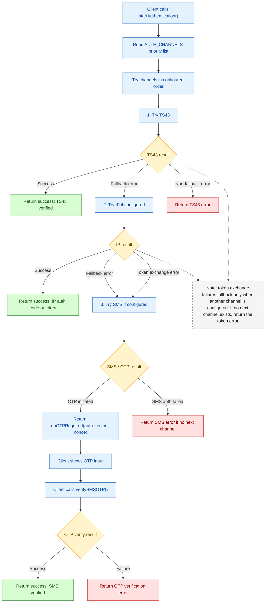
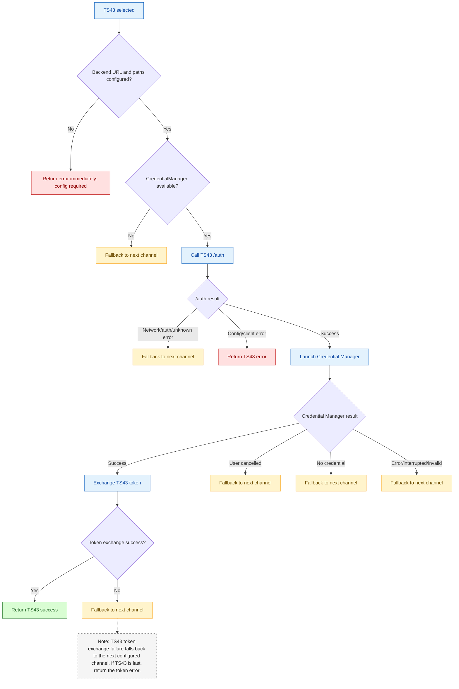
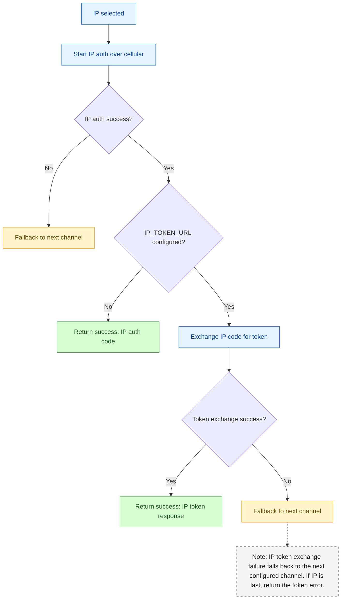
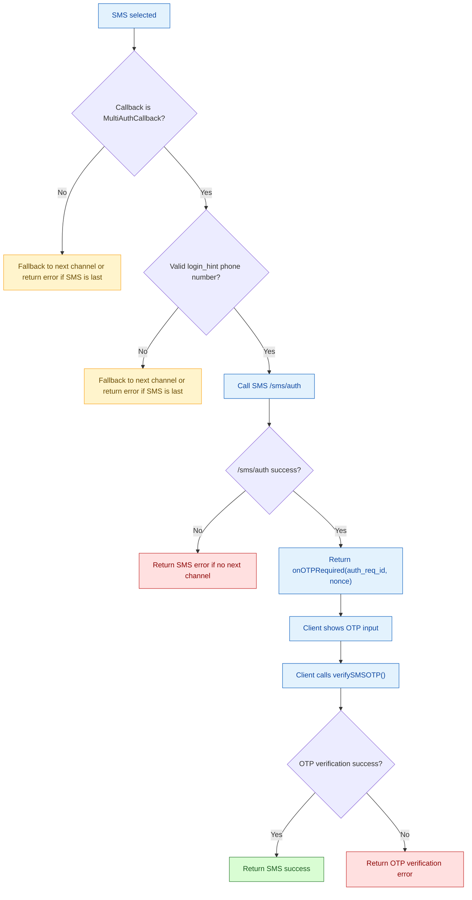

# Multi-Channel Authentication Flow

This version is optimized for Mermaid Chart / mermaid.ai sharing. It avoids long loop-back arrows so the diagram renders compactly.

## High-Level Flow

## TS43 Decision Details

## IP Decision Details

## SMS / OTP Decision Details

## Summary

- The SDK tries channels in the order configured by `AUTH_CHANNELS`.
- A channel success stops the flow and returns success to the client.
- A fallback error moves to the next configured channel.
- A non-fallback error returns immediately. IP token exchange failure falls back when another channel is configured.
- SMS requires `MultiAuthCallback` because OTP is a two-step flow: start SMS auth, then verify OTP.
